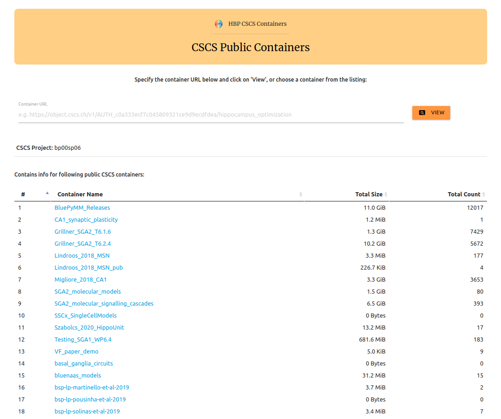

# cscs_viewer
Browser based tool for exploring public CSCS containers. 
  
Available at: 
https://appukuttan-shailesh.github.io/cscs_viewer
  
It provides following features:
  

## View list of public CSCS containers 

Example:

Note: when new containers are added, this list will need to be updated.
  

## Explore the contents of public CSCS containers 
Directories can be explored and individual files can be downloaded. The info is loaded dynamically each time, and thus is up-to-date. Example:

  

Developed by: Shailesh Appukuttan and Andrew Davison, CNRS 
<i>Copyright © 2020 EBRAINS. All rights reserved.</i>

 

### ACKNOWLEDGEMENTS
This open source software code was developed in part in the Human Brain Project, funded from the European Union's Horizon 2020 Framework Programme for Research and Innovation under Specific Grant Agreements No. 720270 and No. 785907 (Human Brain Project SGA1 and SGA2).
