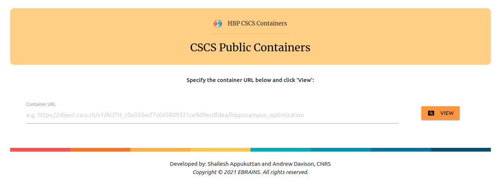
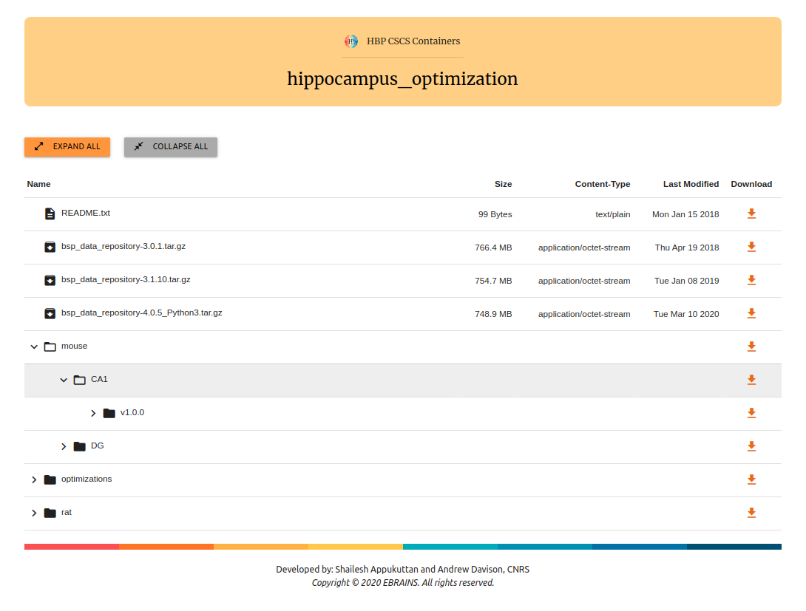

# cscs_viewer
Browser based tool for exploring public CSCS containers. 
  
Available at: 
https://appukuttan-shailesh.github.io/cscs_viewer
  

## Specify a public CSCS container URL

Users can specify the URL for any public container.

Example:

  

## Explore the contents of public CSCS containers 
Directories can be explored and individual files can be downloaded. The info is loaded dynamically each time, and thus is up-to-date. Example:

These links can be bookmarked for direct access in the future.

  

Developed by: Shailesh Appukuttan and Andrew Davison, CNRS 
<i>Copyright © 2021 EBRAINS. All rights reserved.</i>

 

### ACKNOWLEDGEMENTS
This open source software code was developed in part in the Human Brain Project, funded from the European Union's Horizon 2020 Framework Programme for Research and Innovation under Specific Grant Agreements No. 720270, No. 785907 and No. 945539 (Human Brain Project SGA1, SGA2 and SGA3).
